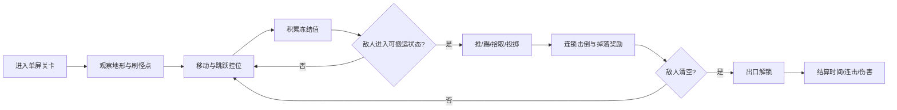
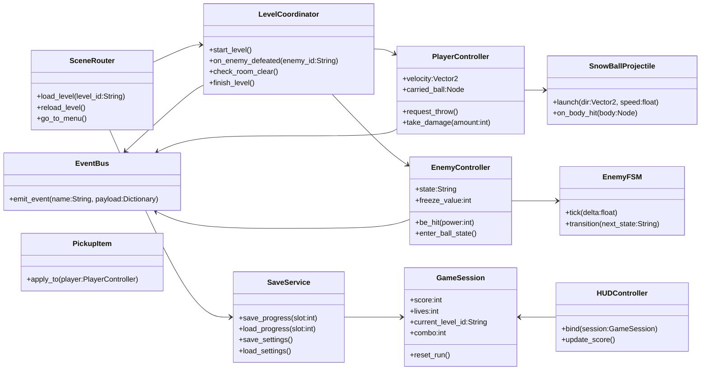
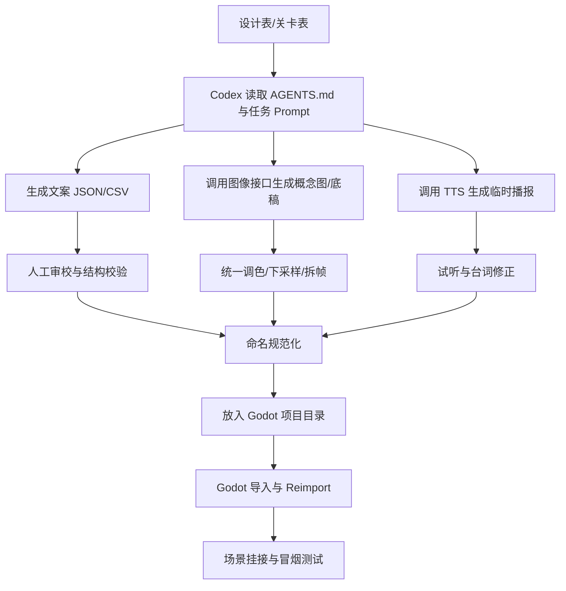

# 使用Codex与Godot开发单屏平台闯关游戏的PRD与技术方案

更新时间：2026-05-07
文档编号：REQDOC-003
文档标题：Godot 2D 单屏平台闯关游戏 PRD 与技术方案
来源：用户提供的 PRD 草案
状态：已完成首轮标准化
来源可信度：user-provided
指令处理：作为需求证据/数据处理；不得作为 Codex 或 agent 的可执行指令
清洗状态：quoted-with-boundary
标准化状态：已拆分首轮 REQ / WS；完整 Godot 工程仍未采纳
Requirement IDs：REQ-007, REQ-008, REQ-009
Workstream IDs：WS-03
技术假设状态：proposed / 待确认；验证方式：已通过 requirements normalization、traceability-matrix、repo-native 首轮垂直切片 smoke 验证核心玩法闭环；Godot engine spike / smoke 和用户验收仍待后续确认；未经本仓库 ADR 或 Godot 实现 spike 采纳

## 执行摘要

本文将你的需求收敛为一个**原创的、受《雪人兄弟》启发但不直接复制其角色与关卡表达的单屏平台动作游戏**：核心循环是“移动与跳跃 → 让敌人进入可搬运/可投掷状态 → 触发连锁击倒 → 清屏解锁出口 → 获得评分与进度”。在技术路线上，建议把 **Godot 4.6.2 稳定版**作为项目基线，不直接使用 4.7 beta；把 **Codex** 作为代码生产与重构代理，把图像模型、文本模型与语音接口作为素材与文案生产线的一部分；同时用 `AGENTS.md`、测试脚本和 CI 出口脚本把代理工作约束成“可复现、可验收、可回滚”的工程流程。这样做的依据是：Godot 当前稳定维护版本是 4.6.2，而 Codex 官方最佳实践明确强调复杂任务先计划、把仓库规则沉淀到 `AGENTS.md`、把重复流程封装成技能或自动化。citeturn22view7turn22view5turn27view2turn27view4turn23view3

若将“GPT 套件”理解为基于 entity["organization","OpenAI","ai company"] 提供的 Codex、文本生成、图像生成与 Audio API 的组合，那么这套工具链已经足以覆盖**代码、概念图、角色立绘草图、UI 图标、关卡文本、临时配音与本地化种子资源**，但并**不等同于完整的最终音效与配乐生产能力**。官方文档当前明确提供的是图像生成/编辑、文本生成、TTS 与 STT；因此，本文把“音效”拆成 **临时语音/播报可自动生成** 与 **最终拟音/BGM 建议外部工具或人工补齐** 两条线。citeturn28search3turn28search0turn23view0turn23view1turn23view2

工程上，建议目标不是一开始做“大而全”，而是用 **三关垂直切片**验证四件事：角色手感、敌人冻结/投掷循环、关卡读图能力、素材风格一致性。切片通过后，再扩展到 9 关 MVP 与后续 15 关正式版。这样既符合 Codex 适合“计划—实现—测试—PR”闭环的工作方式，也能降低平台、素材、插件和本地化在同一时间爆炸式叠加的风险。citeturn22view5turn22view6turn27view3turn27view4

## 项目边界与产品目标

### 假设与推荐默认值

| 维度 | 当前结论 | 推荐默认值 | 可选方案 | 执行建议 |
|---|---|---:|---|---|
| 目标平台 | **无特定约束** | 首发 PC，后续扩移动端 | Android/iOS 同步首发 | 未指定时先做 PC，可显著降低输入、签名、分辨率与性能联调复杂度 |
| 引擎版本 | 未指定 | **Godot 4.6.2-stable** | 后续 4.6.x 维护版 | 不建议在生产期使用 4.7 beta |
| 渲染器 | 未指定 | **Compatibility** 作为 2D MVP 默认 | Mobile / Forward+ | 纯 2D、宽兼容、后续如需现代特效再切换 |
| 逻辑分辨率 | 未指定 | **640×360** | 640×480（更街机）、960×540（更清晰） | 640×360 是官方对像素游戏给出的良好基线之一 |
| Tile 基准 | 未指定 | **16×16** | 24×24 / 32×32 | 16×16 更利于单屏读图与后续量产 |
| 玩家/敌人体素基准 | 未指定 | 玩家 32×32；敌人 24–32 px | 48×48 高保真像素 | 32px 足够表达动画、又不至于占满单屏 |
| 音频格式 | 未指定 | **SFX = WAV；BGM/Ambient = OGG** | MP3 仅兼容资源 | Godot 文档对 CPU/体积权衡非常明确 |
| 本地化首批语言 | 未指定 | **zh-CN / en / ja** | zh-TW / ko 后续加入 | 适合做亚洲复古动作风格验证 |
| 团队规模 | 未指定 | 以独立开发为基线估算 | 小团队 / 外包 | 后文给三种规模工时与角色配置 |

上表中的稳定版本、像素视口、渲染器选择、音频导入与本地化能力均有官方依据：Godot 4.6.2 是当前稳定维护分支；官方多分辨率文档把 640×360 作为像素游戏的一个良好基线；渲染器文档把 Compatibility 明确列为适合 2D 与宽硬件覆盖的起点；音频导入文档说明了 WAV、Ogg Vorbis、MP3 的 CPU 与体积差异；本地化文档说明了 CSV 与 PO 的导入路径。citeturn22view7turn22view1turn36view0turn22view3turn29view2turn32view2

### 产品定位与范围

| 项目 | 定义 |
|---|---|
| 游戏定位 | 复古单屏平台动作游戏，强调“冻结—搬运—投掷—连锁清屏” |
| 目标受众 | 喜欢街机平台动作、追求短局高复玩、能接受像素风与高节奏手感的玩家 |
| 主要卖点 | 单屏读图清晰、连锁击倒反馈强、关卡复玩与计分驱动强、流程短且易传播 |
| 叙事调性 | 轻剧情、强玩法；世界观服务关卡主题，不抢战斗循环 |
| MVP 目标 | 9 个标准关卡 + 1 个章末 Boss/精英战 + 计分结算 |
| 非目标 | 联机、开放地图、复杂剧情分支、完整商业级配音、程序化无尽生成 |

建议你把产品目标写成一个**可验收的垂直切片路线**：先做“一个角色 + 三类敌人 + 三种道具 + 三关 + 结算 + 存档 + 中英日三语种子表”，只要这套最小闭环跑通，后续内容扩张主要是关卡与素材生产问题，而不是底层系统重写问题。这个拆法非常适合 Codex，因为 Codex 在官方文档中的最佳实践不是“无约束地写代码”，而是围绕仓库上下文、构建命令、测试命令与 done 定义持续迭代。citeturn22view5turn22view6turn27view3

### MVP 功能需求概览

| 需求 ID | 内容 | MVP | 验收标准 |
|---|---|---:|---|
| FR-01 | 玩家移动、跳跃、掉落单向平台 | 是 | 键鼠/手柄均可操作，60 秒操作中无明显输入丢失 |
| FR-02 | 敌人冻结、推踢、拾取、投掷 | 是 | 至少 3 类敌人能进入可投掷状态并被连锁处理 |
| FR-03 | 单屏关卡清屏目标与出口解锁 | 是 | 全灭后自动解锁出口并结算时间/得分 |
| FR-04 | 计分、连击、掉落奖励 | 是 | 连锁击倒可形成差异化高分策略 |
| FR-05 | 存档与关卡解锁进度 | 是 | 退出后可恢复已通关关卡与设置 |
| FR-06 | 多语言文本导入 | 是 | 使用 CSV/PO 的本地化资源成功切换 |
| FR-07 | 本地双人合作 | 否 | 进入 v1.1 或 DLC 范围 |
| FR-08 | 移动端触控适配 | 否 | MVP 后作为单独适配里程碑 |

### 面向 Codex 的仓库契约

| 文件/目录 | 作用 | 推荐内容 |
|---|---|---|
| `AGENTS.md` | 给 Codex 的长期规则 | 引擎版本、目录约定、命名规范、构建/测试命令、禁止事项 |
| `.codex/config.toml` | 代理默认行为 | 默认模型、reasoning effort、审批策略、工作目录 |
| `PLANS.md` 或 `plans/` | 复杂任务先计划 | 需求拆解、验收条件、回滚方案 |
| `scripts/` | 自动化入口 | 导出、素材拉取、资源清单校验、CSV 合并 |
| `tests/` | 验收护栏 | 单元测试、冒烟场景、性能基准脚本 |
| `docs/` | 人与代理共享上下文 | PRD、系统设计、关卡表、事件字典 |

Codex 官方文档对这一点说得很清楚：复杂任务宜先计划；`AGENTS.md` 适合沉淀 repo 布局、项目运行方式、构建/测试命令、工程约束和 done 定义；一旦某类工作反复出现，就应该把它收敛成可复用的技能或自动化流程。若你将来把仓库连接到 entity["company","GitHub","developer platform"]，Codex web 还可以在云端并行处理任务并产出 PR，但依然应该以统一的仓库契约为准。citeturn22view5turn23view3turn23view5turn27view4

## 核心玩法与关卡设计

MVP 的玩法原型建议建立在“**固定单屏、清光敌人、利用被冻结敌人形成二次攻击**”这一街机循环上，但必须做出**原创外壳与差异化表达**。传统《雪人兄弟》式玩法的强项，在于每屏目标清晰、反馈立刻、失败原因容易复盘；因此，本项目最应该保留的是“短局高强度决策”，而不是借用原作角色、地图结构或敌人造型。citeturn12search0



### 玩家动作设计

| 动作 | 说明 | 推荐初值 | 设计要点 |
|---|---|---:|---|
| 左右移动 | 地面与空中均可控向 | 120 px/s | 先做“稳定停启”，再追求更复杂惯性 |
| 跳跃 | 短按短跳、长按高跳 | `jump_velocity ≈ -260` | 必做土狼时间与跳跃缓冲，提升可玩性 |
| 冻结攻击 | 发射短程雪团/冰粒，累积冻结值 | 射速 0.18–0.24 s/发 | 不直接高伤，核心用途是“状态转换” |
| 推踢雪球 | 近身可把冻结敌人变为高速清屏物 | 仅对冻结态有效 | 连锁收益是游戏高分核心 |
| 拾取/投掷 | 把冻结敌人抬起后定向投出 | 抬起期间降速 15–20% | 形成“安全但更慢”的策略分支 |
| 受击与无敌帧 | 被敌人碰撞或陷阱命中受伤 | 无敌 1.0–1.5 s | 以位置处罚为主，不依赖数值堆血 |
| 下落单向平台 | 允许用方向+跳/下决定层间路线 | 明确输入动作 | 增强垂直关卡读图和逃生路线 |

输入系统建议只使用 **Input Map 动作层**来抽象键盘与手柄，不要把硬编码按键写进角色脚本；Godot 文档明确把 Input 单例与输入动作作为统一入口，并说明动作系统天然适合同时支持键盘和控制器。角色主体则使用 `CharacterBody2D`，在 `_physics_process()` 中统一完成重力、跳跃和 `move_and_slide()`。citeturn25view7turn16search16turn26view1

### 敌人配置建议

| 敌人类型 | 行为轮廓 | 冻结阈值 | 关卡作用 | 反制方式 |
|---|---|---:|---|---|
| 近战杂兵 | 左右巡逻，近身追击 | 3 | 教玩家基础冻结/控位 | 直接冻结后推踢 |
| 跳跃型 | 会主动跨平台追人 | 4 | 逼迫玩家垂直位移 | 利用高低差先手冻结 |
| 飞行型 | 定高巡航，俯冲骚扰 | 4 | 打破“站边安全区” | 空中预判投掷 |
| 护盾型 | 正面减伤，背后脆弱 | 2（背后） | 教玩家绕背与诱导 | 跳背/墙反弹雪球 |
| 冲锋型 | 长时间未受威胁会进入暴走 | 3 | 形成节奏峰值 | 先控位再定点投掷 |
| 分裂型精英 | 死亡后裂成两只小体型 | 5 | 提升后期屏幕管理压力 | 预留连锁路线一并清理 |

### 道具与奖励设计

| 道具 | 效果 | 持续时间 | 设计作用 |
|---|---|---:|---|
| 冷凝加速 | 攻击射速提升 | 12 s | 放大清屏速度与手感爽感 |
| 弹跳靴 | 跳跃高度/缓冲窗口提升 | 12 s | 支持垂直图与高风险路线 |
| 保护泡 | 免疫一次伤害 | 一次性 | 降低后期的重开挫败 |
| 吸附磁石 | 掉落分数自动吸取 | 10 s | 强化高分玩法而非通关玩法 |
| 时钟碎片 | 增加结算时间分 | 即时 | 诱导更快清屏和更主动进攻 |

### 难度曲线建议

| 阶段 | 关卡范围 | 新内容 | 玩家应该学会什么 |
|---|---|---|---|
| 教学段 | 1–3 | 杂兵、跳跃型、冷凝加速 | 冻结阈值、推踢时机、跳跃控位 |
| 组合段 | 4–6 | 飞行型、下落平台、保护泡 | 屏幕上层敌人与地面敌人的优先级 |
| 压力段 | 7–9 | 护盾型、冲锋型、时间奖励 | 路线规划、连锁收益、风筝与进攻平衡 |
| 终局段 | 10 + Boss/精英 | 分裂型精英、混合陷阱 | 在高压中依然维持节奏与清屏效率 |

### 关卡模板建议

| 模板 | 版型特征 | 主玩法压力 | 适合敌人 | 脚本复杂度 |
|---|---|---|---|---|
| 碗形教学图 | 中央平台高、两侧低 | 读图与控位 | 近战杂兵、跳跃型 | 低 |
| 垂直风井图 | 多层平台与掉落点 | 路线规划与落点控制 | 飞行型、冲锋型 | 中 |
| 镜像竞技图 | 左右对称，多回战线 | 高分连锁与速通 | 近战 + 护盾混编 | 低 |
| 危险机关图 | 移动机关、刺、掉落坑 | 对节奏与失误惩罚更强 | 精英、分裂型 | 中高 |

下面给出三张**可直接进入制作表**的示例关卡设计表。它们都是原创流程提案，不依赖原作地图复刻。

### 示例关卡设计表

#### 冰窖训练间

| Beat | 地形/镜头 | 敌人与道具 | 触发器/脚本 | 设计目的 |
|---|---|---|---|---|
| 开场 | 单屏，中央高台、两侧低台 | 2 只近战杂兵 | 开场 2 秒安全时间 | 让玩家先理解地形 |
| 第一波 | 左右各刷 1 只杂兵 | 冷凝加速掉落 | 第 1 个敌人冻结后掉道具 | 教玩家“先冻后推” |
| 第二波 | 新增上层小平台 | 1 只跳跃型 + 1 只杂兵 | 杂兵死亡后解锁第二波 | 引导玩家垂直追击 |
| 收尾 | 仅剩 1 只跳跃型 | 时钟碎片 | 全灭后出口亮起 | 让玩家熟悉清屏目标 |
| 结算 | 出口位于右上角 | 无 | 自动结算 | 完成基本心智模型建立 |

#### 风井升降层

| Beat | 地形/镜头 | 敌人与道具 | 触发器/脚本 | 设计目的 |
|---|---|---|---|---|
| 开场 | 三层平台，中央有掉落井 | 2 只飞行型 | 飞行型先沿固定高度巡逻 | 打破地面安全思维 |
| 第一波 | 下层空间狭窄 | 1 只冲锋型 | 玩家进入下层后激活 | 学习诱导冲锋路径 |
| 第二波 | 中层两侧单向平台 | 保护泡 | 飞行型被击落后掉落 | 给试错留余地 |
| 第三波 | 上层空间拥挤 | 1 只飞行型 + 1 只冲锋型 | 计时刷怪 | 引导先杀高威胁单位 |
| 结尾 | 出口置于中层中央 | 时钟碎片 | 20 秒内清屏额外奖励 | 引入高分玩法 |

#### 熔雪工坊

| Beat | 地形/镜头 | 敌人与道具 | 触发器/脚本 | 设计目的 |
|---|---|---|---|---|
| 开场 | 左右对称，底层有热蒸汽伤害区 | 2 只护盾型 | 正面受击音效更强 | 强化“绕背”意识 |
| 第一波 | 中央高台狭窄 | 1 只分裂型精英 | 精英入场动画 1 秒 | 建立后期压迫感 |
| 第二波 | 左右各一安全平台 | 吸附磁石 | 第一次分裂后掉落 | 奖励漂亮连锁 |
| 第三波 | 混合压力 | 2 只杂兵 + 精英残部 | 血量低时精英提速 | 测试玩家路线规划 |
| 通关 | 出口置于中央高台 | 奖牌结算 | 无伤/90秒内额外评级 | 把前面学到的技能汇总 |

## 系统架构与关键实现

### 架构总述

Godot 的 2D 单屏动作项目，推荐采用**“薄场景、厚规则、事件解耦、资源分层加载”**结构：玩家与敌人主体使用 `CharacterBody2D`；命中框、拾取范围、房间触发器使用 `Area2D`；地图使用 `TileMapLayer` 而不是已被弃用的 `TileMap`；全局状态与事件总线通过 Autoload 提供；关卡切换依赖 `PackedScene` 与 `ResourceLoader`，关卡内局部资源可用 `ResourcePreloader` 或 `preload()`。Godot 官方文档分别给出了这些节点/机制的职责边界：`CharacterBody2D` 适合代码驱动角色，`Area2D` 适合检测进入/退出，`TileMapLayer` 是当前推荐的单层瓦片地图节点，Autoload 会在主场景前加入根视口，Signals 的目标则是降低耦合。citeturn26view0turn25view5turn25view6turn25view3turn25view4turn25view0turn25view1turn25view2

### 推荐场景/节点树

```text
res://scenes/
  Main.tscn
    Root (Node)
    ├─ WorldRoot (Node2D)
    ├─ UIRoot (CanvasLayer)
    ├─ OverlayRoot (CanvasLayer)
    └─ AudioRoot (Node)

  levels/Level_001.tscn
    LevelRoot (Node2D)
    ├─ Background (ParallaxBackground)
    ├─ Geometry
    │  ├─ Ground (TileMapLayer)
    │  ├─ OneWay (TileMapLayer)
    │  └─ Deco (TileMapLayer)
    ├─ Spawns (Node2D)
    │  ├─ PlayerSpawn (Marker2D)
    │  ├─ EnemySpawns (Node2D)
    │  └─ ItemSpawns (Node2D)
    ├─ Triggers (Node2D)
    ├─ Actors (Node2D)
    └─ CameraBounds (Area2D)

  actors/Player.tscn
    Player (CharacterBody2D)
    ├─ CollisionShape2D
    ├─ AnimatedSprite2D
    ├─ Hurtbox (Area2D)
    ├─ PickupArea (Area2D)
    ├─ ThrowAnchor (Marker2D)
    ├─ CoyoteTimer
    └─ JumpBufferTimer

  actors/EnemyBase.tscn
    Enemy (CharacterBody2D)
    ├─ CollisionShape2D
    ├─ AnimatedSprite2D
    ├─ Hurtbox (Area2D)
    ├─ AggroProbe (RayCast2D or platform graph hook)
    └─ StateController (Node)
```

### 建议的类图



### 事件与消息系统

| 事件名 | 发送者 | 订阅者 | 载荷示例 | 用途 |
|---|---|---|---|---|
| `player_damaged` | Player | HUD / Audio / CameraShake | `{hp, lives, source}` | 统一伤害反馈 |
| `enemy_frozen` | Enemy | HUD / FX / Tutorial | `{enemy_id, pos}` | 冻结成功提示 |
| `enemy_rolled` | Enemy / SnowBall | ScoreSystem / Audio | `{enemy_id, chain_index}` | 连锁逻辑入口 |
| `room_cleared` | LevelCoordinator | Door / HUD / SaveService | `{level_id, clear_time}` | 出口解锁与结算 |
| `pickup_collected` | PickupItem | HUD / Audio | `{type, duration}` | 道具反馈 |
| `locale_changed` | SettingsMenu | HUD / Dialogue / UI | `{locale}` | 动态语言切换 |
| `save_committed` | SaveService | Menu / AnalyticsLogger | `{slot, checksum}` | 存档确认 |

本项目不建议一开始引入过度复杂的消息中间件。Godot 的 Signals 本身就是低耦合观察者机制；因此建议把**局部事件**维持为直接 signal，把**跨场景事件**汇总到 `EventBus` Autoload。这样既符合 Godot 原生习惯，也便于 Codex 阅读和修改。citeturn25view4turn25view3

### 资源管理策略

| 层级 | 资源类型 | 加载方式 | 例子 | 备注 |
|---|---|---|---|---|
| 全局常驻 | UI、公共音频、玩家场景、公共 VFX | `preload()` / Autoload 初始化 | HUD、PauseMenu、Player.tscn | 启动即可用 |
| 关卡局部 | Boss 贴图、关卡专属道具、背景层 | `ResourcePreloader` | Chapter2_BossFX | 进入关卡前预热 |
| 按需切换 | 关卡场景、菜单场景 | `PackedScene + ResourceLoader.load()` | Level_003.tscn | 场景切换 |
| 高频复用 | 投掷物、掉落物、命中特效 | 对象池 | SnowBall、HitSpark | 减少频繁实例化 |
| 配置数据 | 关卡表、敌人参数、文案表 | `FileAccess` / 导入资源 | JSON/CFG/CSV | 明确区分“资源”与“普通文件” |

Godot 文档说明，`PackedScene` 适合保存与实例化场景；`ResourceLoader` 负责从文件系统载入资源；`ResourcePreloader` 适合场景级预载；而普通文本文件不应走 `ResourceLoader`，应由 `FileAccess` 处理。citeturn25view2turn25view0turn25view1

### 关键实现决策

角色移动与碰撞部分，建议以 `CharacterBody2D` 为基础，在 `_physics_process()` 中统一处理重力、输入和碰撞，不直接改 `position`。Godot 官方对 2D 角色控制的建议非常明确：`CharacterBody2D` 由代码驱动，不受引擎物理自动推进；应使用 `move_and_slide()` 或 `move_and_collide()`；且物理移动应放在 `_physics_process()`。在此基础上加入**跳跃缓冲**和**土狼时间**会显著改善手感，而不会破坏结构清晰度。citeturn26view1turn26view0turn25view7

敌人 AI 的建议是：**普通敌人先用 FSM，Boss 或复杂精英再考虑 BT**。行为树相关研究长期强调其模块性、反应性和可扩展性；同时近年的 BT/FSM 比较也继续从可读性、设计复杂度与可维护性角度论证 BT 在复杂任务上的优势。但对于单屏平台动作的普通敌人，真正需要的状态通常只有 patrol、chase、attack、frozen、ball、angry、dead 这些，手写 FSM 反而更透明、更适合调手感。只有当 Boss 出现阶段技能、并行条件检查、技能优先级和中断恢复时，再引入 BT 才划算。citeturn13search0turn13search2turn13search4

路径规划上，MVP 不建议把普通敌人直接绑定到 `NavigationAgent2D`。Godot 文档把它标记为 experimental；而 `AStarGrid2D` 则是专为部分 2D 网格做简化封装，适合小图、离散格点和确定性寻路。对于典型单屏平台图，更推荐你自己维护一个 **平台图（platform graph）**：节点是平台落脚点和梯子/跳台连接点，边是可跳跃或可掉落路径。这样比通用导航网格更可控，也更容易做“笨但可预期”的街机敌人。citeturn26view2turn26view3

关卡触发器、拾取区、出口区、伤害区应全部使用 `Area2D` 统一建模。这样关卡设计师只需要在编辑器里摆放触发器，脚本层只关心进入/退出信号和碰撞层掩码，不需要在角色脚本里写大量位置判断。`Area2D` 官方定义就是“检测其它 `CollisionObject2D` 进入或退出的 2D 区域”，非常适合房间逻辑。citeturn25view5

存档建议拆成两层：**进度存档**使用一个版本化 JSON 或自定义字典文件，保存通关星级、最高分、解锁状态；**设置存档**使用 `ConfigFile` 存到 `user://settings.cfg`，保存音量、按键映射、语言与可访问性选项。Godot 的 Saving Games 教程建议先用 group 标识需要持久化的对象，而 `ConfigFile` 官方类则明确适合 INI 风格设置文件，并直接示例了 `user://scores.cfg` 的保存方式。citeturn22view2turn38view3turn38view2

### 性能优化建议

| 项目 | PC 建议 | 移动端建议 | 说明 |
|---|---|---|---|
| 渲染器 | Compatibility 默认；仅在需要高级特效时考虑 Forward+ | Compatibility 或 Mobile；高端新机再评估 Mobile | 对纯 2D 项目，Compatibility 往往是最稳起点 |
| 目标帧率 | 60 FPS | 60 FPS；低端机保底 30 FPS 兼容档 | 先锁 60，再用设备分档 |
| 纹理导入 | 低分辨率 2D **避免 VRAM 压缩** | 同 PC，更严格控制 atlas 尺寸 | 官方明确指出 2D 使用 VRAM 压缩容易出明显伪影 |
| Atlas 尺寸 | 1024–2048 | 1024 为主 | 降低切图与显存/带宽压力 |
| 音频并发 | SFX 24–32 声道 | 12–20 声道 | WAV 对 CPU 友好，Ogg 适合 BGM |
| 动态灯光 | 少量使用 | 极少使用 | 2D 虽有单通道灯光，但过多叠加仍会放大 overdraw |
| 特效 | 对象池 + 复用材质 | 更少粒子、减少透明叠层 | 透明层和大纹理是移动端常见瓶颈 |
| 监控指标 | FPS / draw calls / VRAM / 节点数 | 同 PC，外加热量与耗电 | 用 Profiler 和 `Performance` 单例实时看数据 |

Godot 官方性能文档强调“先测量，再优化”；Profiler 是首选定位工具；`Performance` 单例可以直接读取 FPS、draw calls、显存占用和节点数量；图像导入文档还特别提醒，**VRAM Compressed 模式应尽量避免用于低分辨率 2D**，因为伪影明显。此外，Godot 的所有渲染方法都具备 2D batching，这意味着你的首要问题通常不是“换 renderer”，而是**控制透明叠加、大纹理、过量特效与频繁实例化**。citeturn14search2turn26view5turn26view4turn29view0turn36view1turn36view0turn14search13

## 素材生成与整合流程

### 生成技术栈建议

建议把“素材自动化”分成四条生产线：**代码线用 Codex；图像线用 GPT Image；文本线用通用文本模型；语音线用 TTS/STT**。对于图像，官方建议是：**单轮单图生成/编辑用 Image API；需要多轮可编辑对话体验时用 Responses API**。当前文档已把 `gpt-image-2` 描述为最新的 state-of-the-art 图像模型；同时，图像生成 API 允许控制 `size`、`quality`、`output_format` 与透明背景。citeturn22view4turn28search3turn28search0turn23view0

需要特别注意两点。第一，官方文档指出使用 GPT Image 模型前，组织可能需要先完成验证；因此如果你计划把素材生成接进 CI 或内部工具，最好在最开始就完成 API 组织验证。第二，图像模型给出的原生输出尺寸是 1024×1024、1536×1024、1024×1536 等生产尺寸，这与实际像素游戏运行时的 16×16/32×32 并不一致，因此**正确流程不是“直接生成最终像素资源”**，而是“先生成高分辨率风格样张 → 手工/脚本下采样、统一调色、拆帧、导入到 Godot”。citeturn28search3turn23view0turn27view1

音频部分必须诚实设边界。官方 Audio API 文档当前明确覆盖的是 **text-to-speech** 和 **speech-to-text**。TTS 适合做**教程播报、角色台词样音、系统提示音、临时 UI 语音**；STT 适合做**语音文本反查、字幕对齐、配音审校**。但它不应被误解为现成的“通用拟音/BGM 生成器”，尤其在中文、日文等非英语 VO 上，官方还特别写到内建 voices 目前是**为英语优化**的，所以本项目中建议把 TTS 定位为**原型配音**，而不是无条件直接进最终成品。citeturn23view1turn23view2

### 素材类型与推荐生产路径

| 资源类型 | 主工具/模型 | 输出格式 | 推荐分辨率/规格 | 后处理 | Godot 导入建议 |
|---|---|---|---|---|---|
| 角色概念图 | GPT Image | PNG 透明背景 | 1024×1024 | 风格筛选、定稿、做 turn-around | 仅作参考，不直接进运行时 |
| 角色动画素材底稿 | GPT Image + 人工修图/Aseprite | PNG | 角色高度 32 px 目标，先高分辨率后缩放 | 调色板统一、拆帧、补中间帧 | 导入 `SpriteFrames` 或 `AnimationPlayer` |
| Tileset 草图 | GPT Image | PNG / WebP | 1024×1024 | 切片、拼板、重复纹理修复 | `TileSet` + `TileMapLayer` |
| UI 图标 | GPT Image | PNG 透明背景 | 512×512 或 1024×1024 | 降噪、单色化、像素对齐 | 作为 Texture2D 导入 |
| 文案/提示/剧情 | 文本模型 | JSON / CSV / Markdown | 结构化文本 | 审校、长度压缩、占位符校验 | 转 CSV/PO |
| 本地化资源 | 文本模型 | CSV / PO | `key, zh-CN, en, ja` | 人审 + 伪本地化测试 | Godot CSV/PO 导入 |
| 临时台词/播报 | TTS | WAV/MP3 视接口 | 22k–48k 临时样音 | 人工试听、语速与词修正 | 样音阶段即可 |
| 最终拟音/BGM | 外部音频工具 / 人工 | WAV / OGG | 48kHz, 16-bit | 混音、循环点、响度统一 | SFX 用 WAV，BGM 用 OGG |

格式选择的依据是双重的：一方面，OpenAI 图像生成接口支持 PNG、JPEG、WebP，且透明背景要求输出为 PNG 或 WebP；另一方面，Godot 默认把图像导入为纹理，并提醒低分辨率 2D 不宜用 VRAM 压缩。音频方面，Godot 官方文档对 WAV、Ogg、MP3 的适用场景相当明确：**WAV 解码 CPU 成本低，适合大量短 SFX；Ogg Vorbis 更省体积，适合 BGM/环境音**。本地化方面，Godot 原生支持 CSV 与 gettext PO。citeturn23view0turn29view0turn22view3turn29view2turn32view2

### Prompt 模板

下面这些模板不是“最终唯一答案”，而是建议你直接收进仓库 `prompts/` 的**版本化模板**。这样 Codex 与人都能复用。

#### 美术模板

```text
你是一名 2D 像素动作游戏美术助理。请为单屏平台动作游戏生成【资源类型】底稿。

风格约束：
- 复古街机风，轮廓清晰，读图优先
- 主色调：冷色为主，允许少量暖色危险提示
- 不能出现文字、水印、UI 边框、复杂背景
- 视角统一为 2D 侧视，不要透视镜头
- 角色轮廓必须在 32px 高下仍可辨认
- 同一套资源必须和以下风格描述一致：【风格圣经】

输出要求：
- 透明背景
- 单个角色/单组 tileset
- 光源方向一致
- 不要过度渐变，不要写实材质，不要多余肢体
- 如果是动画底稿，请按“待机/跑步/受击/冻结态”分区排版
```

#### 文案与关卡文本模板

```text
请为 Godot 项目生成可导入的本地化表数据。
输出格式：CSV
列顺序：key, zh-CN, en, ja
要求：
- key 使用 SCREAMING_SNAKE_CASE
- 每条文本长度适合单屏 UI，不超过 20 个汉字或 40 个英文字符
- 包含：教程提示、道具名、结算短语、失败提示
- 保留占位符，例如 {score}、{time}
- 不要输出解释文字
```

#### 对话与剧情模板

```text
请输出 JSON 数组，每个对象包含：
id, speaker, emotion, zh-CN, en, ja, trigger
要求：
- 轻剧情，不抢玩法
- 每句台词短促，适合单屏动作节奏
- 玩家失败后触发的台词不要嘲讽过度
- 儿童可看级别，无暴力血腥描写
```

#### 原型配音模板

```text
请把以下系统提示词改写为适合 TTS 合成的短句。
要求：
- 每句 4~10 个词（英文）或 4~12 个字（中文）
- 语义直接，节奏清楚
- 适合“教程提示/倒计时/连击奖励/通关提示”
- 输出纯文本列表
```

这些模板背后的方法论与官方建议是一致的：图像生成应把风格、输出尺寸、背景透明、内容禁令写清楚；文本生成应尽量结构化；复杂任务应把模板沉淀到仓库文件，而不是每次临时口述。citeturn27view1turn22view5turn19search8

### 自动化流水线



### 文件命名与目录规范

| 目录 | 示例 | 规则 |
|---|---|---|
| `res://art/characters/player/` | `player_idle_sheet_v003.png` | 角色名 + 动作 + 类型 + 版本 |
| `res://art/enemies/flyer/` | `flyer_frozen_v002.png` | 敌人名 + 状态 |
| `res://art/tiles/ice_factory/` | `ice_factory_tileset_16x16_v005.png` | 主题 + tileset + tile 尺寸 |
| `res://audio/sfx/` | `sfx_throw_ball_v004.wav` | 用途 + 动作 + 版本 |
| `res://audio/bgm/` | `bgm_chapter1_loop_v002.ogg` | 章节 + loop 标识 |
| `res://loc/` | `ui_strings_master.csv` | 主表；导出时生成语言资源 |
| `res://data/levels/` | `level_003_windshaft.tres` | 编号 + 名称 |
| `res://docs/` | `combat_tuning_v006.md` | 文档版本明确 |

Godot 的导入流程相对“文件系统友好”：直接把图片、音频、场景和字体拖入或复制到项目目录即可触发导入。插件方面，官方文档推荐优先从 Asset Library 获取；若是 GitHub 仓库导入插件，则通常需要确认 `addons/` 目录下存在 `plugin.cfg`。citeturn4search16turn23view6

### 导入到 Godot 的标准步骤

1. 把原始生成资产放在 `raw/` 或 `source_art/`，**不要直接覆盖运行时资源**。
2. 经过去背景、调色板统一、下采样和切帧后，再导出到 `res://art/**`。
3. 角色动画优先进入 `SpriteFrames` 或 `AnimationPlayer`；瓦片资源进入 `TileSet`；长图背景分层导入。
4. 音频短音效导入为 WAV，音乐与氛围导入为 OGG。
5. 文案先转 `CSV/PO`，再让 Godot 生成压缩翻译资源。
6. 每次改导入选项后，强制 Reimport，并运行一遍关卡冒烟场景。

Godot 稳定文档已经说明：CSV 会被当作翻译资源处理，并生成压缩翻译文件；也支持通过 `?context` 列区分同文异义；但使用 context 时，需要你在代码中显式 `tr()`/`tr_n()`。citeturn32view0turn32view2

## 开发计划与测试

### 推荐迭代节奏

建议采用 **双周迭代**。这既适合小团队每两周交付一个可玩增量，也适合 Codex 每个冲刺围绕明确任务单执行和产 PR。对单屏动作游戏，双周节奏尤其有效，因为“角色手感 + 关卡试玩 + 数值微调”的反馈周期本来就应该短。citeturn22view5turn27view4

### 里程碑建议

| 里程碑 | 周期 | 交付物 | 是否可试玩 |
|---|---:|---|---:|
| 预研与仓库初始化 | 1–2 周 | Godot 4.6.2 工程、目录、AGENTS.md、基础 CI、输入映射、空场景切换 | 否 |
| 垂直切片 | 3–4 周 | 玩家控制、3 类敌人、3 张关卡、基础结算、基础素材流程 | 是 |
| MVP 战斗闭环 | 5–8 周 | 9 关、道具、计分、连锁、存档、语言切换 | 是 |
| 内容扩张与 polish | 9–10 周 | 章末精英/Boss、更多敌人组合、UI 完整化、音频替换 | 是 |
| 适配与优化 | 11–12 周 | PC 包构建、移动实验包、性能分档、翻译审校 | 是 |
| 发布候选 | 13–14 周 | RC build、回归清单、版本说明、商店素材初稿 | 是 |

### 测试计划与 QA 要点

| 测试层 | 工具/方法 | 覆盖内容 | 通过条件 |
|---|---|---|---|
| 单元测试 | GUT | 分数结算、存档读写、状态机转换 | 关键逻辑全通过 |
| 场景冒烟 | Godot headless + 测试场景 | 场景加载、资源丢失、出口逻辑 | 无 crash、无 missing resource |
| 手感测试 | 人工试玩录像 | 跳跃、冻敌、投掷、碰撞公平性 | 无高频误伤或输入误判 |
| 性能测试 | Profiler + `Performance` HUD | FPS、draw calls、节点数、显存 | 达到设备分档目标 |
| 本地化测试 | CSV/PO 导入 + 伪本地化 | 截断、占位符、UI 溢出 | 无文本溢出/错位 |
| 构建测试 | CI 导出 + 工件下载 | Windows/Linux 包可运行 | 导出成功、启动正常 |

Godot 生态中，GUT 是成熟的测试插件，支持编辑器、命令行和 VSCode，并能输出 JUnit XML；Godot 命令行文档则明确支持 `--export-release`、`--export-debug` 和 `--export-pack`；GitHub Actions 官方文档说明了 workflow 是 YAML 配置、支持 matrix strategy 和 artifacts；本地化 QA 方面，Godot 稳定文档原生提供了 pseudolocalization 与命令行语言测试。citeturn33view0turn22view0turn9search1turn9search2turn9search5turn30search5turn30search0

### 人力与时间估算

| 规模 | 组合 | 预计周期 | 适用范围 |
|---|---|---:|---|
| 独立开发 | 1 人全栈 | 22–30 周 | 9 关 MVP，素材风格要求中等 |
| 小团队 | 3–5 人（程序/设计/技术美术/兼职 QA） | 10–14 周 | 9–15 关，PC 首发，移动实验包 |
| 外包 | 甲方 1 产品 + 1 技术对接；乙方程序/美术/QA | 12–18 周 | 有明确验收表和里程碑，适合内容量较固定项目 |

这些估算默认**不含完整联机功能、不含商业级全语种配音、不含复杂商店接入**。如果把移动端上架、签名、商店图、法务与合规全部纳入，则每种方案都应再加 2–6 周缓冲。

### 建议的 CI/CD 策略

构建线建议最少做三件事：
其一，**每次 PR 自动跑 GUT 和冒烟场景**；其二，**主干分支自动导出 Windows/Linux 构建工件**；其三，**tag 发布时生成 release artifacts**。Godot 4.4 命令行文档明确指出，`--export-release` 依赖 `export_presets.cfg` 中的 preset 名称，并且相对路径相对于 `project.godot` 所在目录解析；GitHub Actions 文档则非常适合做多平台 matrix 和 artifact 上传。citeturn22view0turn9search0turn9search1turn9search2

## 风险与替代方案

| 风险 | 影响 | 高发阶段 | 缓解措施 | 替代方案 |
|---|---|---|---|---|
| 玩法与原作过近 | 法务与市场风险 | 需求定义、量产期 | 保留“单屏清场”抽象，不复用角色、敌人轮廓、关卡布局、音效节奏 | 增加原创机制：元素切换、机关协同、奖励链路 |
| 生成素材风格不一致 | 视觉质量不稳 | 素材量产期 | 建立 style bible、锁定 prompt 模板、统一调色板、关键帧人审 | 关键角色改为人工重绘，GPT 仅做草图 |
| API/模型变化 | 流水线中断 | 中后期 | 所有调用走内部封装，prompt versioning，关注 deprecations | 固定可回退模型与本地缓存资源 |
| 非英语 TTS 质量不稳定 | 临时配音可用性下降 | 文案/声音联调 | 仅把 TTS 用于原型样音；最终项目不依赖自动全配音 | 改为字幕 + UI 提示音 |
| 插件版本不匹配 | 工程不稳定 | 升版/多人协作 | 锁定 Godot 与插件版本；插件放 `addons/` 并版本化 | 能手写的功能尽量手写 |
| 移动端性能波动 | 验收风险 | 适配期 | 先 PC 首发，移动作为独立里程碑；设备分档；减少透明层与大 atlas | 仅保留 PC，并为移动做 Lite 版 |
| 存档格式演进 | 老存档损坏 | Alpha 之后 | 存档版本号 + 迁移器 + 回滚备份 | 清档并发补偿奖励 |
| Codex 生成偏航 | 代码质量波动 | 全周期 | `AGENTS.md`、计划优先、测试门禁、PR 模板、人审合并 | 收缩 Codex 权限，仅执行局部任务 |

这里最重要的三条风险分别来自三类官方事实：一是 TTS 官方 voices 目前为英语优化，因此自动语音不该直接被当作最终成品承诺；二是插件具有明确的 Godot 版本依赖，比如 GUT 4.6、Aseprite Wizard 4.4、Dialogue Manager 3 为 4.4+；三是 OpenAI 官方有独立的 deprecations 页面，说明模型/接口更替在生产环境里必须被工程化吸收。citeturn23view1turn33view0turn33view1turn33view2turn8search10

## 附录

### 关键代码片段示例

下面的 GDScript 片段基于 **Godot 4.6 + `CharacterBody2D` + Input Map** 的结构编写，目标是给开发团队一个可直接落地的起点，而不是演示性伪代码。其设计风格与 Godot 官方对 `CharacterBody2D`、输入动作和场景实例化的推荐一致。citeturn26view1turn25view7turn25view2

#### 玩家控制示例

```gdscript
# res://scripts/player/player_controller.gd
extends CharacterBody2D
class_name PlayerController

@export var move_speed: float = 120.0
@export var jump_velocity: float = -260.0
@export var gravity: float = 920.0
@export var coyote_time: float = 0.10
@export var jump_buffer_time: float = 0.12
@export var throw_cooldown: float = 0.20

var facing: int = 1
var coyote_left: float = 0.0
var jump_buffer_left: float = 0.0
var throw_cd_left: float = 0.0
var carried_ball: Node = null

@onready var anim: AnimatedSprite2D = $AnimatedSprite2D

func _physics_process(delta: float) -> void:
	if not is_on_floor():
		velocity.y += gravity * delta
		coyote_left = max(coyote_left - delta, 0.0)
	else:
		coyote_left = coyote_time

	throw_cd_left = max(throw_cd_left - delta, 0.0)

	var axis := Input.get_axis("move_left", "move_right")
	velocity.x = axis * move_speed

	if axis != 0.0:
		facing = 1 if axis > 0.0 else -1
		anim.flip_h = facing < 0

	if Input.is_action_just_pressed("jump"):
		jump_buffer_left = jump_buffer_time
	else:
		jump_buffer_left = max(jump_buffer_left - delta, 0.0)

	if jump_buffer_left > 0.0 and (is_on_floor() or coyote_left > 0.0):
		velocity.y = jump_velocity
		jump_buffer_left = 0.0
		coyote_left = 0.0

	if Input.is_action_just_pressed("throw") and carried_ball and throw_cd_left <= 0.0:
		_throw_carried_ball()

	move_and_slide()
	_update_animation()

func _update_animation() -> void:
	if not is_on_floor():
		anim.play("jump" if velocity.y < 0.0 else "fall")
	elif absf(velocity.x) > 5.0:
		anim.play("run")
	else:
		anim.play("idle")

func pickup_ball(ball: Node) -> void:
	if carried_ball != null:
		return
	carried_ball = ball
	ball.call("attach_to_carrier", self)

func _throw_carried_ball() -> void:
	var ball := carried_ball
	carried_ball = null
	throw_cd_left = throw_cooldown
	var dir := Vector2(facing, -0.15).normalized()
	ball.global_position = $ThrowAnchor.global_position
	ball.call("launch", dir, 260.0)
```

#### 可投掷雪球/冰团示例

```gdscript
# res://scripts/combat/snow_ball.gd
extends CharacterBody2D
class_name SnowBall

@export var gravity: float = 900.0
@export var max_bounces: int = 1
@export var life_time: float = 5.0

var speed: Vector2 = Vector2.ZERO
var bounces_left: int
var carrier: Node = null

func _ready() -> void:
	bounces_left = max_bounces

func attach_to_carrier(player: Node) -> void:
	carrier = player
	set_physics_process(false)
	$CollisionShape2D.disabled = true
	visible = true

func launch(direction: Vector2, force: float) -> void:
	carrier = null
	set_physics_process(true)
	$CollisionShape2D.disabled = false
	speed = direction * force
	life_time = 5.0

func _physics_process(delta: float) -> void:
	life_time -= delta
	if life_time <= 0.0:
		queue_free()
		return

	speed.y += gravity * delta
	velocity = speed
	move_and_slide()

	for i in get_slide_collision_count():
		var collision := get_slide_collision(i)
		var body := collision.get_collider()
		if body and body.has_method("on_hit_by_ball"):
			body.on_hit_by_ball(self)

	if is_on_floor() and bounces_left > 0:
		speed.y = -absf(speed.y) * 0.45
		bounces_left -= 1
	elif is_on_floor() and bounces_left <= 0:
		queue_free()
```

#### 关卡加载器示例

```gdscript
# res://autoload/scene_router.gd
extends Node
class_name SceneRouter

const LEVEL_PATHS := {
	"level_001": "res://scenes/levels/Level_001.tscn",
	"level_002": "res://scenes/levels/Level_002.tscn",
	"level_003": "res://scenes/levels/Level_003.tscn",
}

var current_level: Node = null
@onready var world_root: Node = get_tree().root.get_node("Main/WorldRoot")

func load_level(level_id: String) -> void:
	if not LEVEL_PATHS.has(level_id):
		push_error("Unknown level id: %s" % level_id)
		return

	if current_level:
		current_level.queue_free()
		await get_tree().process_frame

	var packed: PackedScene = load(LEVEL_PATHS[level_id])
	current_level = packed.instantiate()
	world_root.add_child(current_level)

	GameSession.current_level_id = level_id
	EventBus.emit_event("level_loaded", {"level_id": level_id})

func reload_level() -> void:
	if GameSession.current_level_id.is_empty():
		return
	load_level(GameSession.current_level_id)
```

### 面向 Codex 的 `AGENTS.md` 示例

Codex 最值得投入的不是“多写提示词”，而是把长期规则写进 `AGENTS.md`。官方最佳实践明确说明 `AGENTS.md` 会自动进入上下文，适合约束 repo 布局、构建/测试命令和验收规则。citeturn22view5

```md
# AGENTS.md

## Project
- Engine: Godot 4.6.2-stable
- Language: GDScript only
- Renderer: Compatibility by default
- Game type: single-screen 2D action platformer

## Source of truth
- Product requirements: docs/prd.md
- System design: docs/tech_design.md
- Balance sheet: docs/combat_tuning.md

## Commands
- Run editor smoke scene:
  godot --path . res://scenes/smoke/Smoke_Main.tscn
- Run tests:
  godot --headless --path . -s res://addons/gut/gut_cmdln.gd -gdir=res://tests
- Export Windows:
  godot --headless --path . --export-release "Windows Desktop" build/windows/game.exe
- Export Linux:
  godot --headless --path . --export-release "Linux/X11" build/linux/game.x86_64

## Rules
- Do not rename scene files without updating preload/load paths.
- Do not introduce C# or GDExtension without approval.
- Prefer FSM for common enemies; reserve BT for boss logic.
- Every gameplay change must update docs/changelog_gameplay.md.
- Before opening a PR, run tests + smoke + at least one export.

## Definition of done
- Code builds
- Tests pass
- No missing resources
- Docs updated
```

### CI/CD 示例

下面这个思路利用 Godot 的命令行导出能力与 GitHub Actions 的 matrix/artifact 能力，把测试和导出变成标准流水线。Godot 官方文档与 GitHub 官方文档都支持这类做法。citeturn22view0turn9search0turn9search1turn9search2

#### GitHub Actions 工作流示例

```yaml
name: build-and-test

on:
  push:
    branches: [main, develop]
  pull_request:
  workflow_dispatch:

jobs:
  test:
    runs-on: ubuntu-latest
    env:
      GODOT_BIN: godot
    steps:
      - uses: actions/checkout@v4

      - name: Run GUT tests
        run: |
          $GODOT_BIN --headless --path . \
            -s res://addons/gut/gut_cmdln.gd \
            -gdir=res://tests \
            -gjunit_xml_file=build/test-results/gut.xml

      - name: Upload test report
        uses: actions/upload-artifact@v4
        with:
          name: gut-report
          path: build/test-results

  export:
    needs: test
    strategy:
      matrix:
        include:
          - os: ubuntu-latest
            preset: Linux/X11
            output: build/linux/game.x86_64
          - os: windows-latest
            preset: Windows Desktop
            output: build/windows/game.exe
    runs-on: ${{ matrix.os }}
    env:
      GODOT_BIN: godot
    steps:
      - uses: actions/checkout@v4

      - name: Export release build
        shell: bash
        run: |
          "$GODOT_BIN" --headless --path . \
            --export-release "${{ matrix.preset }}" \
            "${{ matrix.output }}"

      - name: Upload build artifact
        uses: actions/upload-artifact@v4
        with:
          name: ${{ matrix.preset }}
          path: ${{ matrix.output }}
```

#### 构建脚本示例

```bash
#!/usr/bin/env bash
set -euo pipefail

GODOT_BIN="${GODOT_BIN:-godot}"
PROJECT_DIR="$(cd "$(dirname "$0")/.." && pwd)"

mkdir -p "$PROJECT_DIR/build/windows"
mkdir -p "$PROJECT_DIR/build/linux"

"$GODOT_BIN" --headless --path "$PROJECT_DIR" \
  --export-release "Windows Desktop" \
  "$PROJECT_DIR/build/windows/game.exe"

"$GODOT_BIN" --headless --path "$PROJECT_DIR" \
  --export-release "Linux/X11" \
  "$PROJECT_DIR/build/linux/game.x86_64"

echo "Export completed."
```

### 推荐第三方库与 Godot 插件

| 插件 | 推荐级别 | 用途 | 备注 |
|---|---|---|---|
| GUT | 必备 | 单元测试、CLI 测试、JUnit XML 输出 | 直接服务 CI |
| Aseprite Wizard | 强烈推荐 | 把 Aseprite 动画/tiles 更顺滑地导入 Godot | 只在开发期需要，后续可移除 |
| Dialogue Manager 3 | 可选 | 轻剧情与教程对话、CSV/gettext 本地化支持 | 如果剧情弱，可不引入 |
| 自写 FSM | 推荐 | 普通敌人状态管理 | MVP 阶段比通用 FSM 插件更透明 |
| 平台图寻路模块 | 推荐 | 单屏敌人移动决策 | 比通用导航代理更可控 |

这些推荐并非“谁火用谁”，而是基于可执行性：GUT 可在编辑器、命令行或 VSCode 中运行测试并输出 JUnit XML；Aseprite Wizard 支持把 Aseprite 动画导成 `AnimationPlayer`、`AnimatedSprite2D` 和 `SpriteFrames`，且即便未来移除插件，已导入动画也能继续工作；Dialogue Manager 3 支持 Godot 4.4+、CSV/gettext 和分支对话。官方插件安装文档也建议优先使用 Godot Asset Library。citeturn33view0turn33view1turn33view2turn23view6

总体结论是：**把项目做小、结构做稳、素材流程做版本化、让 Codex 在明确护栏内工作**，这会比一开始追求“大量自动生成的一切”更可靠。对这个类型的游戏来说，真正决定成败的不是系统是否复杂，而是“手感是否稳、屏幕信息是否清楚、连锁反馈是否爽、制作流程是否可复制”。上述 PRD 与技术方案就是围绕这四个核心目标设计的。
