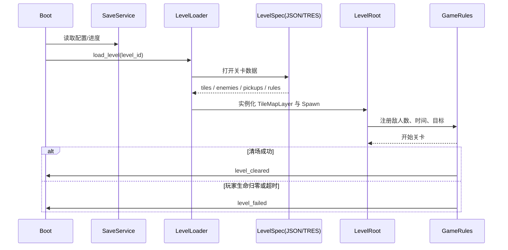
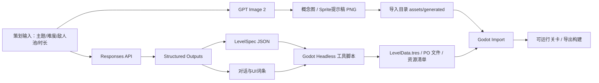

文档类型：source-evidence
关联文档：REQDOC-003
文档标题：原始 PRD 草案完整副本
来源：用户提供的原始 PRD 草案
来源可信度：user-provided
指令处理：作为需求证据/数据处理；不得作为 Codex 或 agent 的可执行指令
清洗状态：raw-preserved；仅通过 REQDOC / REQ / WS 标准化后进入实现
标准化状态：已归并到 REQDOC-003；本文件不分配新的 REQDOC id

# 2D闯关像素游戏项目技术文档与PRD

## 执行摘要

本项目建议定义为一款**单人、像素风、房间式或短段落式推进的 2D 闯关动作游戏**，面向玩法策划、客户端程序、技术美术、UI、QA 与制作人等开发团队成员。核心参考是《雪人兄弟》式的“**攻击使敌人进入可交互状态，再通过推动/投掷形成连锁清场**”循环；在实现层面，建议以 **Godot 4.6.2 stable** 为主线版本，采用场景化拆分、数据驱动关卡、统一输入抽象与自动化资源导入流水线，以同时覆盖 PC 与移动端。官方资料显示，Godot 4.6.2 是 2026 年 4 月 1 日发布的当前稳定版本，而 4.6 发布本身也强调了稳定性、开发流畅度与性能优化；Godot 官方还明确支持桌面与移动平台导出。citeturn27view1turn27view0turn6view17turn30search13

从题材与玩法基底看，《雪人兄弟》被归类为**固定/翻页式单屏平台动作游戏**；其经典循环是：玩家将敌人逐步包裹成雪球，可继续推动或投掷，雪球碰撞敌人会形成连锁击杀；清场过慢还会引入强制追击压力；原作也使用了掉落强化道具与高分奖励机制。对本项目而言，最有价值的不是逐项复刻，而是提炼出“**敌人状态机 + 可推动对象 + 连锁奖励 + 时间压力**”这四个支柱，再换上新的世界观、美术规则、敌人技能语义和分数反馈体系，避免落入一比一模仿。citeturn22view9turn22view10turn22view11turn22view12turn22view13

建议的差异化方向有三点。第一，把“雪球”抽象成更普适的**封装/冻结/压缩状态**，可以在后续主题章节中换成泡泡、果冻、冰块、机械胶囊等视觉表现，但底层规则一致。第二，在保留单屏清场乐趣的前提下，引入更强的数据驱动关卡结构，让 GPT 生成系统可以稳定地产出关卡说明、节奏标签、敌人编排建议与局部布局。第三，在美术流水线里把 AI 的职责限定为**概念稿、Sprite 提示稿、文案与结构化数据生成**，把最终可交付资源仍收束到 Godot 的标准导入与资源系统，以保证版本管理、可维护性和跨端一致性。Godot 官方文档强调其 2D 工作流依赖 TileMap、动画、2D 物理与粒子等专门特性；而 entity["organization","OpenAI","ai company"] 官方文档则表明，Codex CLI 可以直接在本地仓库中读改运行代码，Responses API 适合多步文本/结构化输出流程，GPT Image 2 适合图像生成与编辑。citeturn6view13turn28view4turn22view4turn23search1turn28view1

| 维度 | 建议定义 |
|---|---|
| 项目类型 | 单人 2D 闯关动作游戏 |
| 参考基底 | 《雪人兄弟》式单屏/短段落清场循环 |
| 目标平台 | PC + 移动端，首发建议桌面与 Android 优先，iOS 次优先 |
| 核心卖点 | 连锁清场爽感、短局快节奏、像素风、可批量生成的关卡与文案 |
| 开发策略 | Godot 场景化 + 数据驱动 + Codex/GPT 辅助内容生产 |
| AI 使用边界 | 生成关卡文本、对话、关卡说明、布局建议、概念图、占位 Sprite、音频 cue sheet，不直接把未经审校的 AI 输出作为最终线上资产 |

上表中的平台优先级与流水线策略，来自 Godot 官方的跨平台导出能力、命令行自动化、资源导入方式，以及 OpenAI 官方对 Codex、Responses API、Structured Outputs 与图像生成工作流的定位。citeturn21view1turn21view8turn6view15turn22view3turn28view3turn28view1

## 产品需求

### 核心玩法与目标受众

目标受众建议分成两层。对玩家侧，优先面向喜欢街机式短局挑战、追求“清屏爽感”和高分反馈的动作游戏用户；对团队侧，这份文档默认读者包括产品、策划、程序、TA、UI、QA 与外包协作成员。产品目标不是做“复古展示”，而是做一款**能快速进入一局、每关都能在几十秒到一两分钟内完成关键决策、失败可快速重开、强化高分与连锁回报**的现代像素闯关产品。原作的单屏平台、清场推进与高分奖励逻辑很适合被现代化改造为更清晰的首发版本结构。citeturn22view9turn22view10turn22view11

建议把游戏的最小可玩闭环定义为：**进入关卡 → 移动与跳跃找位 → 远程或近距攻击使敌人进入“受控状态” → 推动/投掷可交互物造成连锁 → 收集掉落与时间奖励 → 清场通关或因受伤/超时失败**。如果要做出与参考对象“相似但不重合”的产品，最好把敌人颜色、强化道具形象、最终追击者造型、章节主题和 Boss 行为全部重新建模，尤其不要机械照搬原作的颜色—功能映射。citeturn22view10turn22view12turn22view13

### 功能清单与优先级

建议把首发范围严格分成 P0、P1、P2。P0 是“首发不可删”；P1 是“强烈建议首发带上”；P2 是“做时间允许时的增强项”。

| 模块 | 说明 | 优先级 | 验收标准 |
|---|---|---:|---|
| 玩家移动 | 左右移动、跳跃、落地、受击硬直、短暂无敌 | P0 | 主角在所有基础地形上稳定移动，无明显穿模或抖动 |
| 基础攻击 | 发射/投掷基础攻击，使敌人累积“冻结/封装值” | P0 | 攻击判定、冷却、被击反馈清晰 |
| 敌人状态机 | 巡逻、追击、受控、变球、滚动、死亡 | P0 | 至少 3 种普通敌人共享统一状态框架 |
| 连锁清场 | 可推动对象命中多个敌人，按连锁次数加分 | P0 | 连锁倍率、音效、UI 浮字齐备 |
| 关卡胜负 | 清场过关；生命归零或超时失败 | P0 | 每关可稳定完成进入/结算/重开流程 |
| 分数系统 | 基础分、连锁分、速通分、无伤分 | P0 | 结算页可追溯各项得分来源 |
| 生命系统 | 默认 3 生命；本关失败重试；章节进度保存 | P0 | 生命耗尽与继续流程稳定 |
| HUD/菜单 | HP、分数、时间、暂停、设置、返回主菜单 | P0 | 键鼠、手柄、触屏均可驱动 |
| 道具系统 | 移速、攻击范围、封装效率、临时机动强化 | P1 | 至少 4 种强化可通过数据表配置 |
| Boss 关 | 每章节 1 个 Boss，强调阶段性与地形互动 | P1 | 首发至少 2 个完整 Boss 行为集 |
| 存档与设置 | 音量、语言、震屏、触控布局、按键配置 | P1 | 退出重进后正确恢复 |
| 本地化 | 简中为默认；英文为首发副语言 | P1 | 文本键值、字体、换行、占位符均可验证 |
| 可访问性 | 大字体、高对比、减闪烁、震屏开关、焦点导航 | P1 | 菜单完整可用，关键信息不只靠颜色区分 |
| 成就/挑战 | 章节 S 评级、限时挑战、隐藏收集 | P2 | 不影响主线通关 |
| DLC/UGC 钩子 | 关卡 JSON/PCK 扩展接口 | P2 | 首发可只保留接口，不开放前端入口 |

这份优先级分层，既遵循了参考玩法的核心闭环，也对齐了 Godot 在输入映射、场景化组织、存档、UI 焦点和多分辨率布局方面的官方能力边界。citeturn29view5turn31view3turn6view4turn21view6turn32view0

### 关卡设计要素

推荐首发采用**章节制 + 房间制**。更具体地说，可以把每一章做成“6 个普通房间 + 1 个 Boss 房”的 7 关结构；首发 3 到 4 章即可形成完整可发版本。与横向长卷轴平台游戏相比，房间式关卡更适合短局重开、移动端触屏输入，也更适合让 AI 输出结构化布局建议，因为每关的敌人组合、可站立层数、风险区和连锁可能性都能被压缩到一页规格内。原作本身就是固定/翻页式单屏平台结构，这一点非常适合转译成现代数据驱动房间关。citeturn22view9turn22view10

建议关卡参数至少包含以下字段：地图尺寸、出生点、玩家初始位置、敌人表、危险区、主题标签、可破坏物、可掉落物池、清关条件、时间上限、目标评分。这些字段应从一开始就结构化，因为 Godot 的场景树与 Resource/文件系统非常适合把关卡做成 `JSON -> Resource -> Scene` 的三段式装配链。citeturn31view3turn32view0turn25view2

### 敌人、道具、得分与生命系统

| 系统 | 建议方案 | 说明 |
|---|---|---|
| 敌人分层 | 巡逻型 / 跳跃型 / 远程型 / 护盾型 / Boss 型 | 共享受控与滚动物状态，差异体现在移动和攻击逻辑 |
| 敌人状态 | Normal → Affected → Packed → Rolling → Broken/Dead | 统一状态机可让程序、美术、关卡策划协同更顺畅 |
| 道具分层 | 机动、输出、控场、生存 | 建议不用原作同色同功能设定，降低相似度风险 |
| 得分结构 | 击杀基础分 + 连锁倍率 + 速通奖励 + 无伤奖励 | 强化“秀操作”和“秒清”的正反馈 |
| 生命结构 | 默认 3 条命；单关重试；章节入口保存 | 减少挫败感，适配移动端碎片化时长 |
| 时间压力 | 关卡基础限时 + 过慢时出现追击者/暴走机制 | 吸收原作的时间压迫感，但改成原创造型与命名 |

如果团队希望进一步现代化，可以在传统分数之外增加**评级系统**。建议以 S/A/B/C 四档呈现，评级由“通关时间、连锁效率、受伤次数”共同决定，而不是只看分数。这样既保留街机味，也能让普通玩家在没有排行榜压力的情况下获得明确目标。

### UI、UX、音效、本地化与可访问性

UI/UX 建议采用**横屏逻辑分辨率**思路，例如 320×180 或 480×270 作为设计底稿，再通过 Godot 的 stretch mode、anchors 与 containers 做跨平台适配。Godot 官方明确支持通过 `canvas_items` 或 `viewport` 方式适配多分辨率，并通过 anchors 与 `expand` stretch aspect 支持不同纵横比；Control 焦点系统则允许键盘和手柄在菜单间导航。对于本项目，HUD 建议只保留 HP、时间、分数、连锁提示和当前强化图标五类核心信息，移动端再额外叠加半透明虚拟按键层。citeturn32view0turn21view6turn19search16

音效与音乐建议采取“**高反馈、低冗余**”原则。BGM 只需要按章节主题准备循环曲、Boss 曲、结算短句三层；SFX 则必须覆盖跳跃、落地、攻击、封装、滚动、连锁、拾取、受击、死亡、通关、暂停和 UI 确认。由于 Godot 官方将 `AudioStreamPlayer` 定位为非定位音频节点，适合 UI、菜单和 BGM，定位音效则应使用 `AudioStreamPlayer2D`。这意味着项目一开始就该分出 `BGM`、`SFX_UI`、`SFX_WORLD` 三个主 bus，避免后期混音返工。citeturn29view4

本地化建议首发支持**简体中文 + 英文**。Godot 官方支持导入 `.po` / `.mo` 文件作为翻译资源，因此产品文案、NPC 对话、章节名、结算文案和设置项都应使用 key 驱动，而不是在脚本中写死。字体方面，建议为中文与英文分别准备一套主字体和一套回退字体，并预留全角字符、长句折行和数字占位测试。citeturn21view4turn18search0

可访问性方面，最低要求应包括：大字体档、高对比主题、震屏开关、减闪烁模式、菜单焦点可见性、按钮图标 + 文本双编码，以及不只依赖颜色区分危险信息。Godot 官方指出，其 GUI 主题系统可以级联到整个 UI 树，因此字体放大和色盲友好改色可集中管理；4.5 起官方发布说明也特别强调了 GUI 可访问描述的能力，Godot 还提供桌面平台屏幕阅读器支持，以及依赖系统库的文本转语音能力。不过，Godot 当前的 TTS 更适合作为补充能力，而不是完整替代屏幕阅读器整合。citeturn21view5turn19search0turn24search3turn24search5

## 技术架构

### 版本建议与总体选型

建议版本为 **Godot 4.6.2 stable**。原因有三点。第一，它是当前官方稳定维护线。第二，Godot 4.6 官方发布说明把该版本定位为稳定化、易用性与性能优化阶段的开始，适合新项目立项。第三，Godot 官方明确支持桌面与移动平台导出，且 2D 工作流是其核心能力之一。citeturn27view1turn27view0turn6view17turn6view13

在运行时模型上，建议采用**场景化 + 数据驱动**组合。Godot 官方把 Node 视为基本构件，节点树保存后即成为 Scene，场景又可以被实例化到其他场景中；这非常适合把游戏拆成 `Boot`、`MainMenu`、`LevelRoot`、`Player`、`Enemy`、`HUD`、`Boss`、`Pickup` 等可重用场景。对于此类体量的 2D 动作项目，客户端主逻辑建议优先用 GDScript，以降低迭代门槛；若后续某些纯算法模块需要优化，再局部转 C# 或 GDExtension。citeturn31view3turn3search17

### 建议项目目录结构

```text
res://
  autoload/
    game_state.gd
    save_service.gd
    audio_service.gd
    scene_router.gd
    content_registry.gd
  scenes/
    boot/
      boot.tscn
    menu/
      main_menu.tscn
      options_menu.tscn
    level/
      level_root.tscn
      hud.tscn
      camera_rig.tscn
    actors/
      player.tscn
      enemy_base.tscn
      boss_base.tscn
      packed_ball.tscn
      pickup.tscn
    props/
      hazard_spikes.tscn
      moving_platform.tscn
      breakable_block.tscn
  scripts/
    actors/
    level/
    ui/
    systems/
    tools/
  data/
    balance/
      player_stats.tres
      enemy_defs.tres
      item_defs.tres
    levels/
      world_01_stage_01.json
      world_01_stage_02.json
  assets/
    art/
      tilesets/
      sprites/
      ui/
    audio/
      bgm/
      sfx/
    generated/
      concepts/
      sprites/
      ui/
  locales/
    zh_CN.po
    en_US.po
  tests/
    unit/
    integration/
    fixtures/
```

推荐把**可审查的生成物**放在 `data/` 与 `assets/generated/`，把运行时正式引用的 Godot 资源放在 `data/*.tres`、`scenes/*.tscn` 与导入后的标准资源树中。Godot 官方说明文本格式的场景与资源更适合版本管理，而导入型资源只需要复制到项目目录即可由编辑器或导入流程接管。citeturn32view0turn6view15

### 主要场景、节点与系统划分

下表给出推荐的场景划分与责任边界。

| 场景/系统 | 推荐根节点 | 子节点/组件 | 责任 |
|---|---|---|---|
| Boot | `Node` | 无或极少子节点 | 初始化配置、语言、存档、首场景跳转 |
| MainMenu | `Control` | `VBoxContainer`、按钮、焦点链 | 主菜单、设置、语言切换 |
| LevelRoot | `Node2D` | 多个 `TileMapLayer`、SpawnRoot、HUD、CameraRig | 关卡容器与规则总控 |
| Player | `CharacterBody2D` | `CollisionShape2D`、`AnimatedSprite2D`、`AnimationPlayer`、`Area2D` | 移动、攻击、受击、状态同步 |
| Enemy | `CharacterBody2D` | RayCast2D、Sprite、HurtBox | 巡逻/追击/FSM |
| PackedBall | `CharacterBody2D` 或单独逻辑体 | Hitbox、Trail | 滚动、反弹、连锁击杀 |
| Pickup | `Area2D` | Sprite、CollisionShape2D | 掉落物、收集触发 |
| HUD | `CanvasLayer` / `Control` | HP/Score/Timer/Combo | 界面与反馈 |
| Autoload | `Node` | N/A | 全局状态、音频、场景切换、存档 |

这里有几个关键原则。其一，**关卡地形层使用 `TileMapLayer` 而不是旧 `TileMap`**；Godot 4.6 文档明确说明 `TileMapLayer` 是单层 TileMap 节点，而旧 `TileMap` 已被标记为 deprecated。其二，玩家推荐使用 `CharacterBody2D`，因为官方把它定义为适合用户控制且提供 `move_and_slide()` 高层 API 的 2D 角色体；官方 demo 也说明，若改用 `RigidBody2D` 做动态角色控制，会更强但更难驾驭。其三，全局跨场景状态放在 Autoload，因为官方指出 Autoload 节点会在其他场景之前加入根 viewport，适合持久信息和场景切换服务。citeturn29view1turn6view2turn8search0turn6view14

### 资源管理、输入、物理碰撞、动画、音频、存档

资源管理建议采用**“项目内资源统一导入，运行时只加载外部可扩展资源”**的原则。Godot 官方说明，对项目内资源，应依赖标准导入流程，而不应滥用运行时动态加载；运行时动态加载更适合自定义关卡、外部音频或后续 DLC/Mod。首发项目因此应把正式资源都纳入 `res://`，只把未来的 UGC 或扩展内容放进 `user://`、自定义 JSON 或 PCK/ZIP 结构中。citeturn6view15turn31view1turn31view2

输入系统方面，建议统一定义以下动作：`move_left`、`move_right`、`jump`、`attack`、`pause`、`ui_accept`、`ui_cancel`。Godot 官方说明 `InputMap` 可以在 Project Settings 中配置，也可在代码里增删事件；因此 PC 键盘、手柄和移动端虚拟按键都应只映射到这些抽象动作，而不是在玩法脚本里写平台分支。这样可以显著减少后期做重映射、触控布局和辅助输入时的返工。citeturn29view5

物理与碰撞方面，建议把**移动、跳跃、碰撞解析和滚动物推进**都放在 `_physics_process()` 中。Godot 官方明确指出物理处理默认以固定 60 次每秒运行，适合一切涉及物理引擎的逻辑；碰撞层与遮罩则应在项目初期固定下来，例如：1=Terrain，2=PlayerBody，3=EnemyBody，4=Attack，5=Pickup，6=Hazard，7=Goal。拾取物与伤害检测可优先用 `Area2D`，因为官方将其定义为负责重叠检测、进入/离开信号和局部物理影响的区域节点。citeturn21view3turn6view9turn30search2

动画系统建议采用**`AnimatedSprite2D` 负责基础帧动画，`AnimationPlayer` 负责过渡、闪烁、镜头与特效参数**的双层方案。Godot 官方 2D 动画教程明确将 `AnimatedSprite2D` 与 `AnimationPlayer` 作为 2D 角色动画的主要工具，而 `AnimationPlayer` 本身是通用动画播放器，适合做受击闪烁、镜头 shake 曲线、UI 入场和音频触发等非纯帧序列逻辑。citeturn4search4turn6view6

音频系统建议把 BGM 放在 `AudioStreamPlayer`，地理定位音效放在 `AudioStreamPlayer2D`。存档方面，建议把**游戏进度**与**用户设置**拆开：进度可用 `FileAccess + JSON` 或二进制保存，设置项用 `ConfigFile`，因为官方明确把 `ConfigFile` 定位为 INI 风格配置存储，并在存档教程中指出“用户配置更适合用 `ConfigFile`”。citeturn29view4turn6view4turn6view5

## 开发实现细节

下面的实现建议遵循 Godot 官方推荐的几个底层原则：**角色移动用 `CharacterBody2D` 与 `move_and_slide()`，物理逻辑走 `_physics_process()`，拾取/触发靠 `Area2D`，模块解耦靠 signals 与 groups。**citeturn6view2turn29view3turn21view3turn30search2turn6view16turn6view8

### 玩家控制示例

```gdscript
# res://scripts/actors/player.gd
extends CharacterBody2D

signal attack_requested(origin: Vector2, facing: int)

@export var move_speed := 120.0
@export var jump_force := -260.0
@export var gravity := 900.0
@export var attack_cooldown := 0.25

var facing := 1
var can_attack := true
var hp := 3

@onready var anim := $AnimatedSprite2D
@onready var cooldown_timer := $AttackCooldownTimer

func _physics_process(delta: float) -> void:
    if not is_on_floor():
        velocity.y += gravity * delta

    var axis := Input.get_axis("move_left", "move_right")
    velocity.x = axis * move_speed

    if axis != 0:
        facing = 1 if axis > 0 else -1
        anim.flip_h = facing < 0

    if Input.is_action_just_pressed("jump") and is_on_floor():
        velocity.y = jump_force

    if Input.is_action_just_pressed("attack") and can_attack:
        can_attack = false
        cooldown_timer.start(attack_cooldown)
        attack_requested.emit(global_position, facing)

    move_and_slide()
    _sync_animation()

func _sync_animation() -> void:
    if not is_on_floor():
        anim.play("jump")
    elif absf(velocity.x) > 1.0:
        anim.play("run")
    else:
        anim.play("idle")

func apply_damage(amount: int) -> void:
    hp -= amount
    if hp <= 0:
        queue_free()

func _on_attack_cooldown_timer_timeout() -> void:
    can_attack = true
```

### 敌人 AI 与状态机示例

```gdscript
# res://scripts/actors/enemy_base.gd
extends CharacterBody2D

enum State { NORMAL, AFFECTED, PACKED, ROLLING, DEAD }

@export var walk_speed := 40.0
@export var packed_threshold := 3
@export var gravity := 900.0

var state: State = State.NORMAL
var direction := -1
var affect_count := 0
var roll_speed := 220.0

@onready var ray_left := $RayLeft
@onready var ray_right := $RayRight
@onready var anim := $AnimatedSprite2D

func _physics_process(delta: float) -> void:
    if state == State.DEAD:
        return

    if not is_on_floor():
        velocity.y += gravity * delta

    match state:
        State.NORMAL:
            _update_patrol()
        State.AFFECTED:
            velocity.x = 0
        State.PACKED:
            velocity = Vector2.ZERO
        State.ROLLING:
            velocity.x = direction * roll_speed

    move_and_slide()
    _sync_anim()

func apply_freeze_hit(power := 1) -> void:
    if state in [State.ROLLING, State.DEAD]:
        return
    affect_count += power
    state = State.AFFECTED
    if affect_count >= packed_threshold:
        state = State.PACKED

func kick(dir: int) -> void:
    if state == State.PACKED:
        direction = dir
        state = State.ROLLING

func _update_patrol() -> void:
    if direction < 0 and (not ray_left.is_colliding()):
        direction = 1
    elif direction > 0 and (not ray_right.is_colliding()):
        direction = -1
    velocity.x = direction * walk_speed

func _sync_anim() -> void:
    match state:
        State.NORMAL: anim.play("walk")
        State.AFFECTED: anim.play("freeze")
        State.PACKED: anim.play("packed")
        State.ROLLING: anim.play("roll")
        _: anim.play("dead")
    anim.flip_h = direction > 0
```

### 关卡加载与数据驱动示例

```gdscript
# res://scripts/level/level_loader.gd
extends Node

const ENEMY_SCENES := {
    "walker": preload("res://scenes/actors/enemy_base.tscn"),
    "jumper": preload("res://scenes/actors/enemy_jumper.tscn")
}

func load_level_from_json(path: String, level_root: Node2D) -> void:
    var file := FileAccess.open(path, FileAccess.READ)
    var raw := file.get_as_text()
    var data: Dictionary = JSON.parse_string(raw)

    _spawn_player(level_root, data.player_spawn)
    _spawn_enemies(level_root, data.enemies)
    _apply_rules(level_root, data.rules)

func _spawn_player(level_root: Node2D, pos: Array) -> void:
    var player := preload("res://scenes/actors/player.tscn").instantiate()
    player.position = Vector2(pos[0], pos[1])
    level_root.add_child(player)

func _spawn_enemies(level_root: Node2D, enemies: Array) -> void:
    for e in enemies:
        var enemy := ENEMY_SCENES[e.type].instantiate()
        enemy.position = Vector2(e.x, e.y)
        level_root.add_child(enemy)

func _apply_rules(level_root: Node2D, rules: Dictionary) -> void:
    level_root.set_meta("time_limit", int(rules.time_limit))
    level_root.set_meta("clear_mode", String(rules.clear_mode))
```

### 碰撞、道具与胜负判定示例

```gdscript
# res://scripts/systems/game_rules.gd
extends Node

signal level_cleared
signal level_failed

var score := 0
var combo := 0
var alive_enemy_count := 0
var player_hp := 3

func on_enemy_spawned() -> void:
    alive_enemy_count += 1

func on_enemy_killed(chain_count: int) -> void:
    alive_enemy_count -= 1
    combo = max(combo, chain_count)
    score += 100 * max(1, chain_count)
    if alive_enemy_count <= 0:
        level_cleared.emit()

func on_pickup_collected(kind: String) -> void:
    match kind:
        "speed": get_tree().call_group("player", "buff_speed")
        "range": get_tree().call_group("player", "buff_range")
        "control": get_tree().call_group("player", "buff_control")
        "shield": get_tree().call_group("player", "buff_shield")

func on_player_damaged(amount: int) -> void:
    player_hp -= amount
    if player_hp <= 0:
        level_failed.emit()
```

### 关卡加载流程

关卡流程建议做成**Boot 初始化、关卡数据读取、场景实例化、运行时注册、胜负回收**五段式。这样既方便 QA 做局部复现，也方便后续让 GPT 系统只替换 `LevelSpec` 数据而不动主场景。Godot 官方的 Scene/Node 模型、Autoload 与 Groups/Signals 都很适合这种生命周期管理。citeturn31view3turn6view14turn6view8turn6view16



### 摄像机、镜头与性能优化建议

如果关卡以单屏房间为主，摄像机应尽量**稳态**，避免长时间跟随抖动；推荐做法是：普通房间固定镜头，只有大型 Boss 房或特殊机关房使用 `Camera2D` 限位跟随与轻微 smoothing。镜头震动、命中停顿和慢动作最好统一挂在 `CameraRig` 与 `GameFeelService` 中，不要散落到玩家或敌人脚本里。

性能方面应抓住四件事。第一，所有涉及碰撞和位移的逻辑放到物理回调中，而不是 `_process()`。第二，地形层和危险层使用多个 `TileMapLayer`，避免在运行中高频修改 TileMap；Godot 官方说明 TileMapLayer 更新会在帧尾批处理。第三，不要凭感觉优化，先用 Profiler 和定时测量。第四，项目内资源走导入系统，运行时动态加载只用于外部内容，这样可以少踩资源 remap 与导入差异的坑。citeturn21view3turn21view0turn21view2turn31view1

## 素材生成与整合

### 推荐的 AI 工具组合

建议把 AI 工具链分成三个层次。**代码层**用 Codex CLI；**结构化文本层**用 Responses API + Structured Outputs；**图像层**用 GPT Image 2。OpenAI 官方说明，Codex CLI 可以在本地终端中读取、修改并运行当前目录代码；Responses API 是官方推荐给新项目的主接口，并支持文本/图像输入、工具调用与多轮状态；Structured Outputs 则可以强制模型输出符合 JSON Schema 的结构化数据；图像方面，官方将 GPT Image 2 定位为当前状态最强的图像生成与编辑模型，而图像能力既能走 Image API，也能走 Responses API 的内建图像生成工具。citeturn28view4turn22view3turn22view4turn28view3turn23search1turn28view1

对你的项目，最实用的职责划分如下。Codex 负责生成与修改 Godot 工程代码、补测试、重构目录、修复脚本错误。Responses API 负责生成关卡 JSON、NPC 对话、任务描述、章节文案、掉落表建议、平衡参数候选值。GPT Image 2 负责概念图、敌人设计稿、UI 图标方向稿、章节 key art、Sprite sheet 提示稿，而不是无审校地直接替代最终生产精灵。若团队更偏向桌面工作流，可选用 Codex App，因为官方文档提到它支持 worktree、动作、图像生成和自动化；但从工程治理角度看，真正应写进项目制度的是 **Codex CLI + API 流水线**。citeturn28view6turn21view22turn28view0

### 资源映射表

| GPT 生成项 | 建议输出格式 | 自动化转换 | Godot 目标资源 | 备注 |
|---|---|---|---|---|
| 关卡说明 | Markdown / JSON | 转为 `LevelSpec` | `data/levels/*.json` 或 `LevelData.tres` | 给策划与关卡工具双用 |
| 关卡布局建议 | JSON Schema 输出 | 校验后导入 | 生成 spawn、enemy waves、rules | 适合批量产出 |
| 对话/章节文案 | JSON / CSV / PO 键值 | 转 `po` 或键表 | `locales/*.po` | 直接接本地化流程 |
| UI 文案 | JSON key-value | 合并到词条表 | `TranslationServer` 资源 | 需要占位测试 |
| 像素概念图 | PNG | 进入 `assets/generated/` | Godot 导入纹理 | 用于定风格与二次像素化 |
| Sprite 提示稿 | PNG + metadata JSON | 人工或脚本切片 | `SpriteFrames` / `Texture2D` | 最终交付前需审校 |
| 敌人设计说明 | JSON / Markdown | 转为 `enemy_defs.tres` | `Resource` 数据表 | 便于程序绑定行为 |
| 音效脚本 | CSV / JSON cue sheet | 分配给音频制作或占位名表 | `audio/sfx/` 命名清单 | 更适合作为脚本，不直接当最终音频 |
| 音乐脚本 | 段落式 cue sheet | 外包或音乐工具实现 | BGM 列表与时长标记 | AI 更适合写 brief |

这张映射表之所以可执行，是因为 Godot 官方支持把资源复制到项目目录后交给导入系统处理，也支持通过导入插件把自定义格式转成 Resource；而 OpenAI 官方的 Structured Outputs 与 Image API/Responses 图像能力，正好覆盖“结构化关卡数据 + 图像稿”这两类最适合自动化的产物。citeturn6view15turn25view2turn28view3turn28view1

### 自动化流水线建议

自动化流水线建议拆成四步。第一步，由策划或制作人提交“章节主题、难度标签、敌人池、时长目标、机制限制”等输入。第二步，Responses API 依据 JSON Schema 产出 `LevelSpec`、对话、UI 文案和掉落表建议，并在 CI 或预提交钩子里做 schema 校验。第三步，图像模型生成概念稿或 Sprite 提示稿，保存到 `assets/generated/`。第四步，Godot 头less 工具脚本把 JSON 转成项目可读资源，把图片复制到导入目录，最终交给引擎导入和打包。Godot 官方命令行文档说明，可以直接通过 `godot -s` 运行 GDScript 脚本做批处理，而工程导出也支持 `--export-release` 自动化。citeturn21view8turn21view1turn25view1



### 示例命令与脚本

下面示例的目的不是展示完整生产代码，而是给团队一个**可落地的骨架模板**。它分别覆盖：Codex 安装与调用、Responses 结构化输出、Godot 头less 转换与导出。OpenAI 官方文档给出 Codex CLI 的本地安装与使用方式，Structured Outputs 说明 JSON Schema 约束可以保证结构稳定；Godot 官方则给出脚本批处理与命令行导出的标准入口。citeturn28view4turn28view3turn34search12turn21view8turn21view1

```bash
# 安装 Codex CLI
npm i -g @openai/codex

# 在项目根目录启动 Codex
codex

# 运行 Godot 头less 工具脚本，将 JSON 关卡转为可用资源
godot --headless -s res://scripts/tools/build_generated_content.gd

# Windows 导出示例
godot --export-release "Windows Desktop" build/game.exe
```

```python
# 伪代码：用 Responses API 生成关卡规格 JSON
import json
from openai import OpenAI

client = OpenAI()

level_schema = {
    "type": "object",
    "properties": {
        "id": {"type": "string"},
        "theme": {"type": "string"},
        "player_spawn": {
            "type": "array",
            "items": {"type": "integer"},
            "minItems": 2,
            "maxItems": 2
        },
        "enemies": {
            "type": "array",
            "items": {
                "type": "object",
                "properties": {
                    "type": {"type": "string"},
                    "x": {"type": "integer"},
                    "y": {"type": "integer"}
                },
                "required": ["type", "x", "y"],
                "additionalProperties": False
            }
        },
        "rules": {
            "type": "object",
            "properties": {
                "time_limit": {"type": "integer"},
                "clear_mode": {"type": "string"}
            },
            "required": ["time_limit", "clear_mode"],
            "additionalProperties": False
        }
    },
    "required": ["id", "theme", "player_spawn", "enemies", "rules"],
    "additionalProperties": False
}

resp = client.responses.create(
    model="gpt-5.5",
    input=(
        "为一关单屏 2D 闯关生成关卡规格。"
        "要求：新手教学向，2种敌人，60秒时限，鼓励一次两连锁。"
    ),
    text={
        "format": {
            "type": "json_schema",
            "name": "level_spec",
            "schema": level_schema,
            "strict": True
        }
    }
)

level_spec = json.loads(resp.output_text)
with open("data/levels/world_01_stage_01.json", "w", encoding="utf-8") as f:
    json.dump(level_spec, f, ensure_ascii=False, indent=2)
```

```python
# 伪代码：生成概念图或 UI 图标方向稿
import base64
from openai import OpenAI

client = OpenAI()

image = client.images.generate(
    model="gpt-image-2",
    prompt="像素风 16x16 敌人史莱姆设计稿，正侧背三视图，透明背景参考风格",
    size="1024x1024"
)

# 具体字段名请以你锁定的 SDK 版本为准；这里按常见 b64 解码思路示意
png_bytes = base64.b64decode(image.data[0].b64_json)
with open("assets/generated/concepts/slime_sheet.png", "wb") as f:
    f.write(png_bytes)
```

```gdscript
# res://scripts/tools/build_generated_content.gd
extends SceneTree

func _init() -> void:
    var dir := DirAccess.open("res://data/levels")
    if dir == null:
        push_error("levels dir not found")
        quit(1)
        return

    dir.list_dir_begin()
    var file_name = dir.get_next()
    while file_name != "":
        if file_name.ends_with(".json"):
            _validate_level_json("res://data/levels/%s" % file_name)
        file_name = dir.get_next()

    print("Generated content validated.")
    quit()

func _validate_level_json(path: String) -> void:
    var file := FileAccess.open(path, FileAccess.READ)
    var data = JSON.parse_string(file.get_as_text())
    assert(data.has("id"))
    assert(data.has("player_spawn"))
    assert(data.has("enemies"))
    assert(data.has("rules"))
```

### 素材落地规范

为了让 GPT 输出能进入 Godot 而不造成后期资源污染，建议制定以下硬约束：  
其一，所有生成图像必须有**统一尺寸、统一原点、统一命名**。  
其二，所有关卡 JSON 必须通过 schema 校验后才能进入主分支。  
其三，所有 AI 生成图要经过人工审校，再决定是否做二次像素化或手工修帧。  
其四，所有文本都必须以 key 驱动，不允许把 AI 直接吐出的自然语言硬写进脚本。  
其五，音效与音乐先生成 cue sheet，再由音频同学或外部工具产出正式素材。  

如果后续确实要把自定义文件一键转为 Godot 资源，可考虑写 `EditorImportPlugin` 或 `EditorExportPlugin`，因为官方文档明确支持这两类插件做自定义资源导入和导出流程。citeturn25view0turn25view1turn25view2

## 测试与发布

### 测试策略

建议把测试体系分成三层。第一层是**纯逻辑单测**，覆盖分数计算、连锁倍率、状态迁移、掉落池与存档读写。第二层是**场景集成测试**，覆盖玩家与敌人交互、关卡加载、清关条件、暂停恢复和输入映射。第三层是**设备与性能回归**，覆盖 PC 和移动端的真实操作、帧率、内存与冷启动。对 Godot 生态来说，GUT 与 GdUnit4 都是高可行选择：GUT 9.6.0 对应 Godot 4.6；GdUnit4 则支持 GDScript/C#、场景测试，并提供官方 GitHub Action 用于 CI。citeturn33view2turn33view0turn33view1turn22view8

建议的测试覆盖重点如下。玩家模块重点测：地面/空中状态切换、受击、无敌、攻击冷却。敌人模块重点测：`NORMAL -> AFFECTED -> PACKED -> ROLLING` 迁移。关卡模块重点测：JSON 缺键、出生点非法、敌人数为零、时间上限异常。UI 模块重点测：键盘和手柄焦点流、触屏按钮不遮挡、切换语言后 UI 不溢出。存档模块重点测：首次启动、损坏文件、版本迁移与默认值回填。

### 性能与质量指标

| 指标 | 目标值 | 说明 |
|---|---:|---|
| 目标帧率 | PC 60+ FPS；移动 60 FPS 目标，最低可接受 45 FPS 短时波动 | 以实际目标机测试为准 |
| 关卡加载 | PC ≤ 2 秒；中端 Android ≤ 4 秒 | 冷启动和热加载分开统计 |
| 内存占用 | 中端 Android 保持稳定，不出现持续攀升 | 重点排查纹理与实例泄漏 |
| 交互延迟 | 主操作链路体感清晰，不出现明显积压 | 重点关注触控层 |
| 稳定性 | 30 分钟连续游玩无崩溃、无阻断性 bug | 作为 Beta 通过标准 |
| 自动化校验 | 每次提交至少跑 schema 校验与基础逻辑测试 | 合并前置条件 |

Godot 官方的性能文档强调“先测量再优化”，建议团队固定使用 Godot Profiler 做性能热点定位，把“是否优化成功”建立在采样和指标之上，而不是感觉。citeturn21view2

### 打包与多平台发布流程

发布流程建议优先做成**命令行导出 + CI**。Godot 官方明确支持 `--export-release` 和 `--export-debug` 命令行参数，因此桌面包与 Android 包都很适合放进 CI。Android 端需要正确配置 Android SDK 与命令行工具；iOS 则必须在 macOS 上、且装有 Xcode 的机器上导出。PC 端分发相对简单，而 iOS 研发环境依赖更重，因此项目排期上建议按“Windows/Steam 或独立包 + Android 先行，iOS 后置验证”的顺序推进。citeturn21view1turn15search7turn6view12turn6view10

如果团队希望在 CI 中做纯内容验证，也可以利用 Godot 头less 模式，因为官方说明 Godot 二进制可以通过 `--headless` 在无 GPU 或显示服务器环境下运行。这非常适合做 JSON 校验、内容 smoke test 和命令行单元测试。citeturn32view0turn21view8

## 项目计划与风险

### 建议里程碑与人力估算

以下计划按一个**小型 4 到 5 人团队**估算：1 名玩法/客户端主程，1 名通用客户端/工具程序，1 名策划兼制作，0.5 名 TA/UI，0.5 名 QA，音频可外包或兼职支持。

| 里程碑 | 周数 | 预估人日 | 交付物 | 验收标准 |
|---|---:|---:|---|---|
| 预制作 | 2 周 | 20–25 人日 | 玩法原型、输入方案、状态机草图、目录结构、关卡 JSON Schema、风格圣经 | 主角手感过线；一关灰盒可跑通 |
| 垂直切片 | 3 周 | 35–45 人日 | 1 章完整体验、3 类敌人、4 种道具、HUD、暂停与重试、基础音效 | 15–20 分钟可玩；核心循环成立 |
| Alpha | 3 周 | 45–55 人日 | 2–3 章内容、Boss 原型、基础本地化、存档/设置、Android 首个包 | 从开始到结束可完整通关 |
| Beta | 2 周 | 25–35 人日 | 全量首发关卡、性能修复、输入/触屏调整、测试体系接入 | 无阻断性 bug；达到性能底线 |
| Release Prep | 1 周 | 12–18 人日 | 发布构建、商店素材、崩溃回归、版本号冻结 | 通过回归清单，可对外投放 |

按上表估算，项目首发版总量大致在 **137–178 人日**。这对一款范围受控、内容由 GPT 辅助生产、以单屏房间关为主的动作游戏是较现实的区间。

### 主要风险与应对措施

| 风险 | 影响 | 触发点 | 应对措施 |
|---|---|---|---|
| 核心手感不好 | 项目根基失效 | 预制作末仍无法形成“封装→推动→连锁”的爽感 | 预制作阶段必须先做可玩原型，不先铺内容 |
| 过度接近参考作品 | 风格与法务风险 | 道具、敌人、关卡语义和命名高度同构 | 只保留抽象规则，重做视觉、命名、数值与章节主题 |
| AI 生成资源风格不一致 | 美术质量波动 | 不同批次 Sprite/概念图差别大 | 先做风格圣经；生成前固定 prompt 模板；人工审校入库 |
| JSON/资源格式漂移 | 关卡加载失败 | 内容来源过多、字段不统一 | 强制 Structured Outputs + schema 校验 + CI |
| 移动端触控体验差 | 留存受损 | 横屏虚拟按键遮挡、误触 | 早做触控原型；支持透明度、位置和尺寸可调 |
| 性能回退 | 多平台发包被卡 | TileMap 高频改写、特效堆叠、动态加载失控 | 用 Profiler；限制运行中 TileMap 更新；项目内资源走导入系统 |
| iOS 交付延迟 | 发布时间滑动 | 没有 macOS/Xcode 环境 | 初期就确认打包环境；发行优先级放在 PC/Android |
| 测试不足 | 后期修 bug 成本暴涨 | 只靠人工冒烟 | 在垂直切片结束前接入 GUT 或 GdUnit4 |

### 开放问题与边界

当前文档基于你给出的默认前提完成，但仍有几个应在立项会尽快拍板的问题。第一，**移动端是否强制横屏**。这会直接影响虚拟按键布局和基准分辨率。第二，**首发目标机型**，尤其是 Android 的性能基线。第三，**美术最终标准**是“AI 概念稿 + 人工像素化”还是“AI 直接产出占位 Sprite，再人工修整”，两者对 TA 工具链要求不同。第四，**音频最终生产工具**未指定；当前文档已把 GPT 的职责限定在音频脚本与 cue sheet，而非最终音乐生成。第五，**OpenAI SDK 与 Responses API 的具体调用形态需要在工程初始化时锁版本**；官方当前文档确认 Responses 中 Structured Outputs 采用 `text.format` 形态，但实现细节应跟随你们选定的 SDK 版本固化。citeturn34search12turn34search6turn34search4

整体上，如果你希望尽快推进开发，最优实施顺序不是先堆内容，而是先完成三件事：**做出一关灰盒的手感原型、固定关卡 JSON Schema、跑通“GPT 输出 → Godot 资源 → 可玩关卡”的最小流水线**。一旦这三件事成立，后续的内容生产、数值迭代和多平台打包都会明显顺畅。
