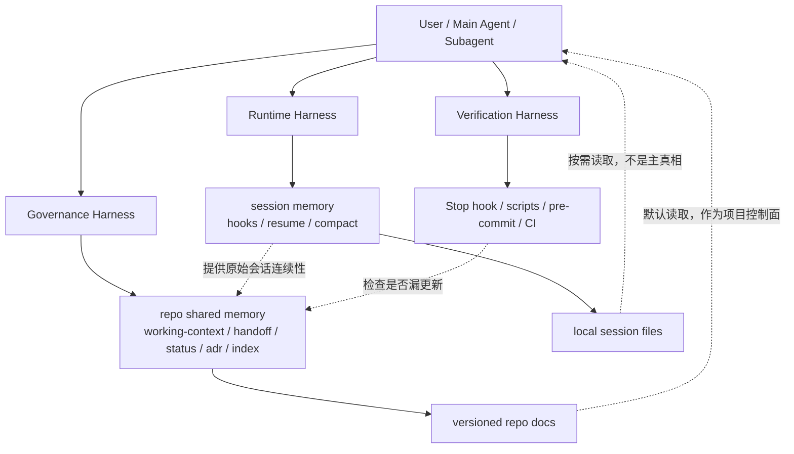

下面这张图，就是我认为你这个项目更合适的 **harness 分层模型**。  
它不是说 ECC 错，而是把 ECC 擅长的运行时能力，和你当前仓库已经建立起来的治理能力，放到同一个框架里看。

**三层分别是什么**

1. `Runtime Harness`
负责“这次会话别断片”。
放这里的东西：
- `session`
- `resume`
- `Stop / SessionStart / PreCompact` 这类 hooks
- 本地会话摘要、运行时记忆

特点：
- 自动化强
- 更偏个人工作流
- 更适合恢复长上下文
- 不适合作为项目共享真相

2. `Governance Harness`
负责“项目真相可接力、可压缩、可审计”。
你当前仓库这层其实已经有了：
- [AGENTS.md](/Volumes/usd/codes/go_projects/ai_ms_pro/AGENTS.md)
- [docs/ai/index.md](/Volumes/usd/codes/go_projects/ai_ms_pro/docs/ai/index.md)
- [docs/ai/working-context.md](/Volumes/usd/codes/go_projects/ai_ms_pro/docs/ai/working-context.md)
- `handoff / status / changelog / adr`

这里的核心不是自动续接，而是：
- 下一位 agent 能不能只读 repo 就接手
- 阶段信息能不能压缩
- 长期决策有没有稳定落点

3. `Verification Harness`
负责“该写的没写，不能悄悄过关”。
你当前也已经有一部分：
- [/.codex/hooks.json](/Volumes/usd/codes/go_projects/ai_ms_pro/.codex/hooks.json)
- [/.codex/hooks/stop_ai_docs_check.py](/Volumes/usd/codes/go_projects/ai_ms_pro/.codex/hooks/stop_ai_docs_check.py)
- [scripts/check_ai_governance.py](/Volumes/usd/codes/go_projects/ai_ms_pro/scripts/check_ai_governance.py)

它不负责当作者，只负责：
- 校验
- 提醒
- 阻断漏更新

**你这个项目里，各层怎么放**

- `session` 属于 `Runtime Harness`
- `working-context` 属于 `Governance Harness` 里的当前态
- `handoff` 属于 `Governance Harness` 里的任务接力层
- `status` 属于 `Governance Harness` 里的阶段压缩层
- `adr` 属于 `Governance Harness` 里的长期记忆层
- `Stop hook + check_ai_governance.py` 属于 `Verification Harness`

**为什么这样分层合理**
因为它正好解释了你前面纠结的那个点：

- ECC 强在 `Runtime Harness`
- 你当前仓库强在 `Governance + Verification Harness`

所以不是“谁替代谁”，而是：
- 只学 ECC，你会得到更强的会话连续性
- 只保留 handoff，你会得到更强的 repo 内共享真相
- 两层结合，才更接近“标准化 vibe coding”

**一句话边界**
- `session`：帮助 AI 记住“刚才发生了什么”
- `handoff`：帮助下一位执行者知道“项目现在该怎么接”
- `verification`：保证前两者没有漏掉关键更新

**最小可行原则**
如果你要继续落地，推荐顺序是：

1. 先保留现在的 `Governance Harness`
2. 再补一个轻量 `Runtime Harness`
3. 不让 runtime hook 直接写共享治理文档
4. 用 verification 去卡漏更

如果你愿意，我下一步可以继续把这张图落成一份非常具体的设计稿：  
直接列出你仓库里每个文件/目录分别属于哪一层，以及它们之间的更新流转关系。